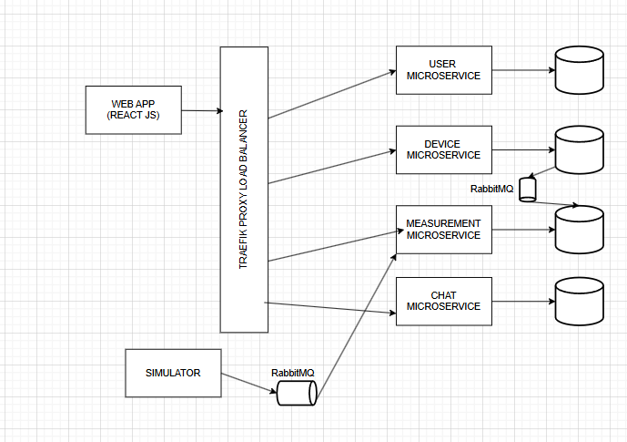

# Energy Management System App

## Overview
The Energy Management System App is a full-stack application developed using a microservices architecture enhanced with Spring Boot for backend operations and React for the frontend. It features real-time interactions such as chat support and notifications through WebSockets and handles service-to-service communication using RabbitMQ and RestTemplate. Traefik serves as the load-balancing proxy, optimizing the distribution of client requests across multiple services.

 
 
## Features
- **Real-Time Interactions**: Integrated WebSockets to facilitate real-time communication for features like chat support and instant notifications.
- **Microservices Communication**: Utilized RabbitMQ for message brokering and RestTemplate for RESTful communication between services.
- **Security**: Implemented JWT for secure and authorized endpoint access, ensuring data integrity and confidentiality across services.
- **Containerization**: The application is fully containerized using Docker, simplifying deployment and scalability.

## Architecture
The system leverages a microservices architecture, with each service handling a specific segment of the application:
- **Frontend**: Built with React, providing a responsive user interface for end-users.
- **Backend Services**: Multiple backend services, each developed using Spring Boot, handling different aspects of the system like user management, device management, and real-time data processing.
- **Load Balancing**: Traefik is configured to manage load balancing, ensuring efficient handling of requests to the backend services.

## Security
- **JWT (JSON Web Tokens)**: Used for secure authentication and authorization across the system.
- **Endpoint Security**: Secure REST endpoints with JWT to ensure that only authorized users can access specific functions.

## Deployment
- **Docker**: All components of the application, including microservices and the Traefik load balancer, are containerized using Docker.
- **Docker Compose**: Used for defining and running multi-container Docker applications.

## Getting Started
To get the project up and running on your local machine for development and testing purposes, follow these steps:

### Prerequisites
- Docker
- Docker Compose
- Node.js and npm

### Installation
1. **Clone the repository**
   ```bash
   git clone https://github.com/Cata826/EnergyManagementSystem.git
